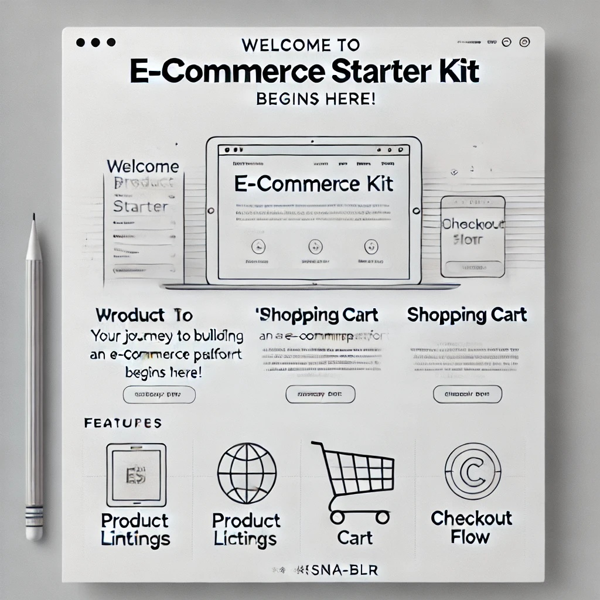

# E-Commerce Starter Kit 🚀

[](https://opensource.org/licenses/MIT)  
[](https://github.com/KRSNA-BLR/ecommerce-starter-kit/stargazers)  
[](https://github.com/KRSNA-BLR/ecommerce-starter-kit/network/members)  

A starter kit for building e-commerce applications with a simple frontend, backend, and database setup.

---

## **Table of Contents**
1. [About the Project](#about-the-project)  
2. [Features](#features)  
3. [Getting Started](#getting-started)  
4. [Examples](#examples)  
5. [Folder Structure](#folder-structure)  
6. [Contribution Guidelines](#contribution-guidelines)  
7. [License](#license)  

---

## **About the Project**

The **E-Commerce Starter Kit** provides developers with a ready-to-use structure for building e-commerce applications. Whether you are starting a new project or looking for inspiration, this kit is designed to save time and effort.

This project includes:
- A basic backend built with Node.js.
- A frontend HTML template for a sample store.
- A simple database file for testing purposes.

### **Why Use This Kit?**
- To speed up the development of your e-commerce application.
- To learn and experiment with a modular project structure.
- To collaborate with others using clear guidelines and examples.

---

## **Features**
- **Frontend**: A responsive HTML template for a store.
- **Backend**: A basic Node.js server with RESTful endpoints.
- **Database**: A simple JSON-based database for testing purposes.
- **Documentation**: Clear instructions and examples for setup and customization.

---

## **Getting Started**

### **Prerequisites**
Before starting, make sure you have the following installed on your system:
- [Node.js](https://nodejs.org/) (v14 or higher)  
- A text editor (e.g., [VSCode](https://code.visualstudio.com/))  

### **Installation Steps**
1. Clone the repository:
   ```bash
   git clone https://github.com/KRSNA-BLR/ecommerce-starter-kit.git
   cd ecommerce-starter-kit
   ```
2. Install dependencies:
   ```bash
   npm install
   ```
3. Start the development server:
   ```bash
   npm run dev
   ```
4. Open your browser and navigate to `http://localhost:3000` to view the application.

---

## **Examples**

### **Sample Product Page**


### **Checkout Workflow**
1. Add items to the cart.
2. Proceed to checkout.
3. Submit payment information.

---

## **Folder Structure**

```
.
├── public/
│   └── index.html         # Frontend HTML template
├── src/
│   ├── server.js          # Main Node.js server file
│   └── routes/
│       └── products.js    # Example RESTful API endpoint
├── database/
│   └── db.json            # Sample JSON database
└── package.json           # Project metadata and dependencies
```

---

## **Contribution Guidelines**

Contributions are welcome! To contribute:  
1. Fork the repository.  
2. Create a new branch for your feature or fix:
   ```bash
   git checkout -b feature/your-feature-name
   ```
3. Commit your changes with a descriptive message:
   ```bash
   git commit -m "Add: your feature description"
   ```
4. Push to your branch and submit a pull request:
   ```bash
   git push origin feature/your-feature-name
   ```

---

## **License**

This project is licensed under the MIT License - see the [LICENSE](LICENSE) file for details.
